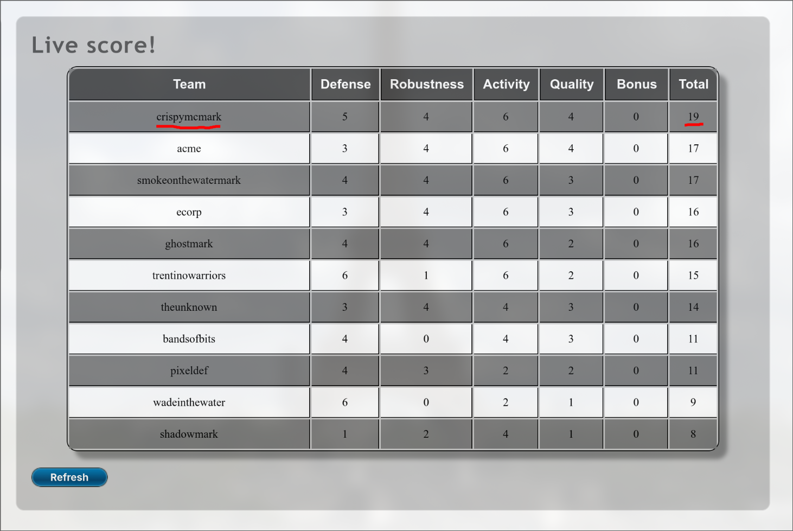
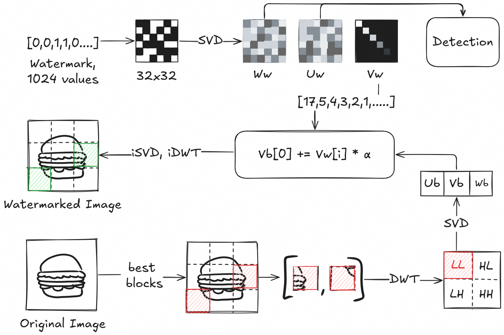
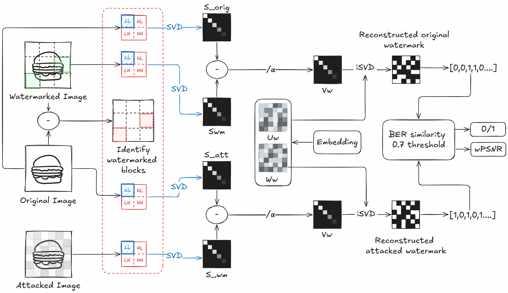
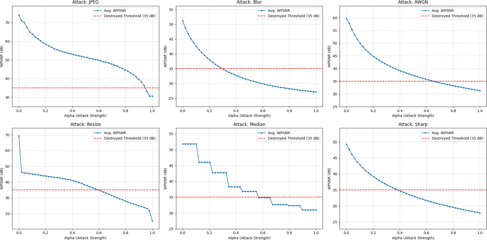
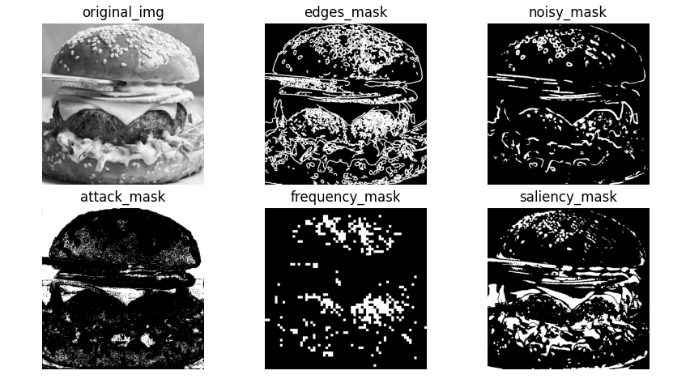
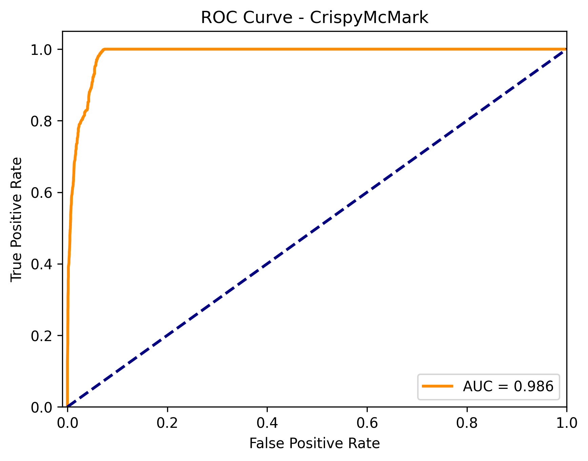

# CrispyMcMark — Watermarking & Attack Suite

Competition repository for *Capture the Mark* (Multimedia Data Security, University of Trento, 2025/2026).

**Group:** crispymcmark

---

## Competition Results 🏆

| Category | Rank | Metric | Score |
|----------|------|--------|-------|
| **Robustness** | 🥇 1st | Avg. attack WPSNR required | 41.16 dB |
| **Activity** | 🥇 1st | Teams attacked | 100% |
| **Quality** | 🥇 1st | Attacks above avg. WPSNR | 18 |
| **Defense** | 🥉 3rd | Avg. watermarked WPSNR | 63.05 dB |



---

## Overview

Complete framework for robust image watermarking with:
- **DWT-SVD block-based embedding** — high robustness, minimal visibility
- **Non-blind detection** — compares original, watermarked, and attacked images
- **Automated attack suite** — binary search + region masks to remove watermarks
- **ROC analysis** — threshold optimization with proper H₀ handling
- **Visualization & GUI** — inspect embedding/detection logic interactively

**Key Design Choice:** We embed only **13 singular values** (not 1024 bits) in high-entropy 8×8 blocks, achieving superior WPSNR and robustness.

---

## Installation

```bash
git clone https://github.com/yourusername/crispymcmark.git
cd crispymcmark
pip install -r requirements.txt
```

**Dependencies:** numpy, scipy, matplotlib, opencv-python, scikit-learn, PyWavelets

---

## Quick Start

```bash
# 1. Embed watermark
python crispy_embedder.py 0005.bmp

# 2. Attack watermarked images
python attack.py

# 3. Detect watermark
python detection_crispymcmark.py

# 4. Visualize embedding
python visualize_embedding.py challenge_images/0005.bmp watermarked_groups_images/crispymcmark_0005.bmp

# 5. Compute ROC curve
python roc_crispymcmark.py
```

---

## How It Works

### 1. Embedding

**Goal:** Hide 13 singular values from the watermark into 13 image blocks.

**Process:**
1. **Prepare watermark fingerprint**
   - Reshape 1024-bit watermark → 32×32 matrix
   - Compute SVD: `U, S, V = svd(watermark)`
   - Extract singular values `S` (32 values)
   - Hardcode `U` and `V` in [`detection_crispymcmark.py`](detection_crispymcmark.py) (per challenge rules)

2. **Select embedding locations**
   - Score all 8×8 blocks using SVD entropy (see [`select_best_blocks`](embedding.py))
   - Choose top 13 blocks with highest complexity (avoid flat/edge regions)
   - Sort by spatial location for deterministic ordering

3. **Embed data**
   - For each of 13 blocks:
     - Apply DWT → extract LL sub-band (low-frequency component)
     - Compute SVD of LL: `U_b, S_b, V_b = svd(LL)`
     - Modify largest singular value: `S_b[0] += α * S[i]` (α=9.0)
     - Reconstruct: `LL_new = U_b @ diag(S_b) @ V_b`
     - Inverse DWT → watermarked block

**Result:** 13 blocks carry one singular value each. WPSNR ≈ 63 dB.



**Key Files:**
- [`embedding.py`](embedding.py) — main embedding logic
- [`crispy_embedder.py`](crispy_embedder.py) — CLI wrapper
- [`detection_crispymcmark.py`](detection_crispymcmark.py) — hardcoded `U_wm`, `V_wm` matrices

---

### 2. Detection (Non-Blind)

**Goal:** Extract watermark from attacked image and verify it matches the original.

**Process:**
1. **Locate watermarked blocks**
   - Compare original vs. watermarked images
   - Identify 13 blocks with changes (see [`identify_watermarked_blocks`](detection_crispymcmark.py))

2. **Extract singular values**
   - For each block in attacked image:
     - Apply DWT → extract LL
     - Compute SVD: `S_attacked = svd(LL_attacked)`
     - Extract difference: `S_extracted[i] = (S_attacked[0] - S_original[0]) / α`

3. **Reconstruct watermark**
   - Combine extracted singular values with hardcoded `U_wm`, `V_wm`:
     ```python
     watermark_matrix = U_wm @ diag(S_extracted) @ V_wm
     ```
   - Flatten and binarize → 1024-bit watermark

4. **Verify detection**
   - Compute similarity: `sim = 1 - BER(original_wm, extracted_wm)`
   - Measure quality: `wpsnr_val = wpsnr(original_img, attacked_img)`
   - **Decision:** Watermark detected if `sim > 0.70` (threshold from ROC)



**Key Files:**
- [`detection_crispymcmark.py`](detection_crispymcmark.py) — `detection(original_path, watermarked_path, attacked_path)`
- [`wpsnr.py`](wpsnr.py) — weighted PSNR metric

---

### 3. Attack Strategy

**Goal:** Remove watermark while keeping WPSNR > 35 dB (challenge requirement).

**Binary Search Process:**
1. **For each attack type** (JPEG, Blur, AWGN, Resize, Median, Sharpen):
   - Start with strength range [0.0, 1.0]
   - Iteratively test mid-point strength
   - If watermark detected → increase strength
   - If watermark not detected AND WPSNR ≥ 35 dB → **success**, decrease strength to find stronger attack
   - If WPSNR < 35 dB → decrease strength
   - Repeat 6 iterations (see [`BIN_SEARCH_ITERATIONS`](attack.py))

2. **Region Masking:**
   - Apply attacks only to specific regions using masks:
     - [`frequency_mask`](masks.py) — target mid-frequency DCT/DWT bands
     - [`entropy_mask`](masks.py) — target high-entropy blocks (where watermark likely is)
     - [`edges_mask`](masks.py) — attack edges (less visible)
     - [`noisy_mask`](masks.py) — attack high-variance regions
     - [`saliency_mask`](masks.py) — attack non-salient regions
     - [`border_mask`](masks.py) — attack image borders
   - Masking formula: `attacked_img = mask ? attack(img) : img`

3. **Parallelization:**
   - Run all attack×mask combinations concurrently using [`ProcessPoolExecutor`](attack.py)
   - Use [`MAX_WORKERS = os.cpu_count()`](attack.py) processes

**Output:**
- Best attack saved to [`attacked_groups_images/`](attacked_groups_images/)
- All attempts logged to [`attacks_log.csv`](attacks_log.csv)
- Summary in [`best_attacks_log.csv`](best_attacks_log.csv)




**Key Files:**
- [`attack.py`](attack.py) — orchestration, binary search, parallelization
- [`attack_functions.py`](attack_functions.py) — JPEG, Blur, AWGN, Resize, Median, Sharpen
- [`masks.py`](masks.py) — mask generators

---

### 4. ROC Analysis

**Goal:** Find optimal detection threshold (balance false positives vs. false negatives).

**Our Approach (Differs from Challenge Baseline):**

**H₁ (Watermark Present):**
- Extract watermark from randomly attacked watermarked images
- Compare with original watermark

**H₀ (Watermark Absent):**
1. Extract watermark from **attacked original (non-watermarked) images**
2. Extract watermark from **destroyed images** (WPSNR ≤ 25 dB)
3. Compare extracted watermark with **random noise watermark**

**Why This Matters:**
- Initial naive ROC gave AUC = 1.0 (perfect square) — **too good to be true**
- Reason: Detector found "watermarks" in non-watermarked images
- Adding proper H₀ samples → AUC = 0.980 (realistic)
- **Threshold chosen:** 0.70 (from FPR < 0.12 criterion)



**Key Files:**
- [`roc_crispymcmark.py`](roc_crispymcmark.py) — ROC computation with enhanced H₀

---

## Python API Examples

### Embed Watermark

```python
from embedding import embedding
import cv2

watermarked = embedding(
    "./challenge_images/0005.bmp",
    "crispymcmark.npy"
)
cv2.imwrite("./watermarked_groups_images/crispymcmark_0005.bmp", watermarked)
```

### Detect Watermark

```python
from detection_crispymcmark import detection

detected, wpsnr_val = detection(
    "./challenge_images/0005.bmp",
    "./watermarked_groups_images/crispymcmark_0005.bmp",
    "./attacked_groups_images/attacked_0005.bmp"
)
print(f"Detected: {detected}, WPSNR: {wpsnr_val:.2f} dB")
```

### Apply Single Attack

```python
from attack import attack_config, param_converters
import cv2

img = cv2.imread("./watermarked_groups_images/crispymcmark_0002.bmp", 0)

attack_func = attack_config["JPEG"]
strength = 0.7
attacked = attack_func(img, strength)

param = param_converters["JPEG"](strength)  # e.g., quality=30
cv2.imwrite(f"./attacked_0002_JPEG_{param}.bmp", attacked)
```

---

## Directory Structure

```
challenge_images/          # Original images
watermarked_groups_images/ # Watermarked outputs
attacked_groups_images/    # Successfully attacked images
tmp_attacks/               # Binary search temp files

embedding.py               # Embedding logic
detection_crispymcmark.py  # Detection + hardcoded U_wm, V_wm
attack.py                  # Attack orchestration
attack_functions.py        # Attack implementations
masks.py                   # Region mask generators 
wpsnr.py                   # WPSNR metric
roc_crispymcmark.py        # ROC curve computation

crispy_embedder.py         # CLI: embed watermark
visualize_embedding.py     # Visualize blocks + singular value changes
attack_blocks_embedding.py # Spatial binary search (experimental)
gui_attack.py              # Tkinter GUI for interactive testing

attacks_log.csv            # All attack attempts
best_attacks_log.csv       # Best attack per image
logger_crispymcmark.csv    # Detection results log

plot/
  plot_attacks.py          # Visualize attack parameter space
  utilities.py             # helpers for plotting
  visualize_embedding.py   # Embedding visualization

presentation/              # Competition slides + diagrams
```

---

## Limitations & Future Work

### Current Limitations
- **Embedding quality depends on image content:** Low-entropy images show visible artifacts
- **Hardcoded watermark:** Detection only works for our specific watermark (U, V matrices fixed)
- **Non-blind detection:** Requires original image

### Proposed Improvements
1. **Redundancy:** Embed multiple copies of each singular value in different blocks
2. **Adaptive α:** Vary embedding strength per block based on local entropy
3. **Better block selection:** Use perceptual models instead of SVD entropy
4. **Explore alternatives:** QIM, spread spectrum in DCT domain

---

## License

MIT License

---

## References

- **Key Files:**
  - Embedding: [`embedding.py`](embedding.py), [`crispy_embedder.py`](crispy_embedder.py)
  - Detection: [`detection_crispymcmark.py`](detection_crispymcmark.py)
  - Attack: [`attack.py`](attack.py), [`attack_functions.py`](attack_functions.py)
  - Masks: [`masks.py`](masks.py)
  - Metrics: [`wpsnr.py`](wpsnr.py)
  - ROC: [`roc_crispymcmark.py`](roc_crispymcmark.py)
