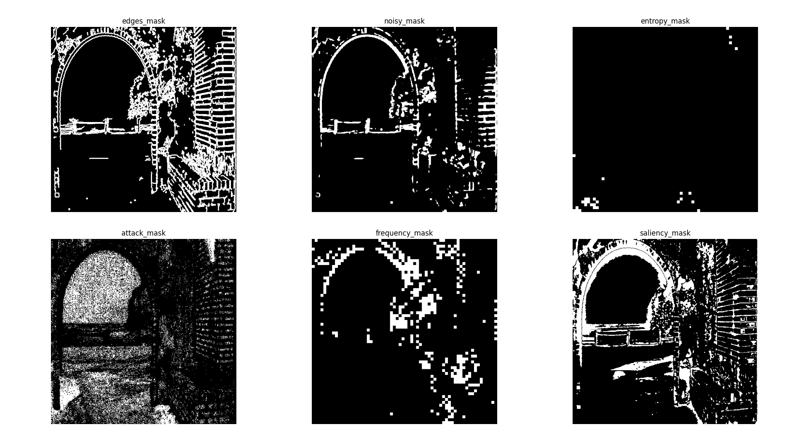
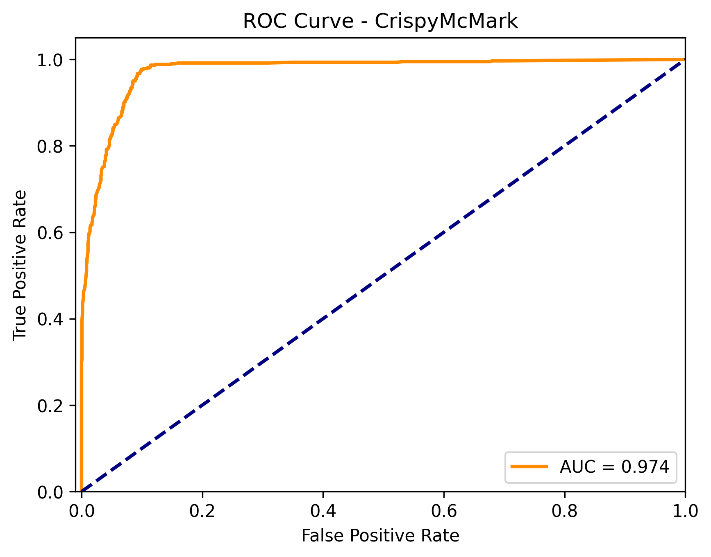
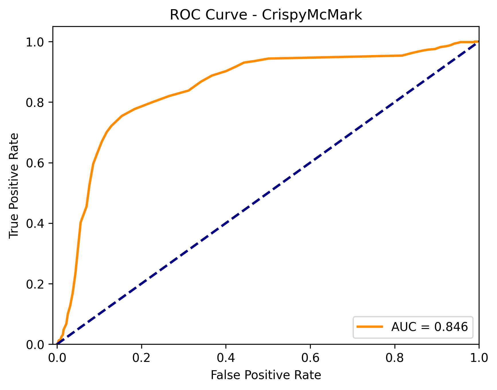

---
---

# Embedding
- reshape watermark to 32x32 and take $U_w,V_w,W_w = SVD(watermark)$
- $U_w,W_w$ hardcoded in the detection, $V_w$ are the singular values
- choose $x$ square blocks
- forall $i<x$:
    - take $LL_b$ of the DWT of $blocks[i]$ 
    - compute the singular values $V_b$ of its $LL$
    - embed $V[i]$ into the first singular value($V_b[0]$)
    - inverse the first two steps to reconstruct the block, and put it back into the image 

---


---

# Detection
- use difference between original and watermarked image to find $x$ watermarked blocks
- forall $i<x$
    - LL of DWT of $blocks[i]$
    - $V_B=$ SVD of LL
    - extract $V_w$ from difference between $V_b[0]$   


---


---

# Attack Strategy
- binary search to find optimal attack strength
- attack functions tweaked to accept parameter $0\leq\alpha\leq1$
- use of masks to attack different areas of the image
- parallelization to improve execution speed

---

# Attack Strategy - binary search

``` py
# JPEG
return int(round((1 - x) * 100))

# Blur
return (x + 0.15) * 3 

# AWGN
return (x+ 0.01) * 40

# Median
return max(1,np.round((1 - x) * 512)) / 512

# Resize
return [[1,3], [3,1], [3,3], [3,5], [5,3], [5,5], [5,7], [7,5], [7,7]][(int(np.floor(x * 8.999)))]

# Sharp
return (x+0.1) * 0.2
```
---

# Attack Strategy - binary search


---

# Attack Strategy - masks


---

# Possible Improvements 
- Add redundancy based on singular value importance 
- Improve the invisibility of attack squares, either by block choice or embedding strength

---

# Implementation challenges 
- Attack resistance is very image-dependent, so harder to immediately measure
- Invisibility is also quite image-dependent
- Hard to understand how the algorithm performed/ find bugs based on the provided ROC function: we added some additional checks in the ROC to better understand the performance of our extraction in different scenarios.
- Not enough time to refine the design and try different techniques(better block choice algorithm, add redundancy etc...)

---

# ROC1: Original 


---

# ROC2: ROC1 + check original(attacked) images 
<!-- label original image + some attacks as label(0) -->


---

<!-- nella presentazione spiegare che qui è uguale ma che quando stavamo facendo sviluppo veniva diverso/ci ha forzato a cambiare threshold -->
# ROC3: ROC2 + label 0 for destroyed 


---

# Effects of hardcoding some of the watermark 
<!-- if we try to embed a different watermark than our group's the algorithm is shit -->


