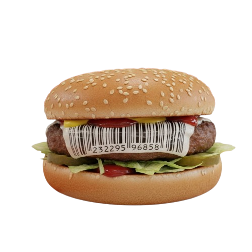
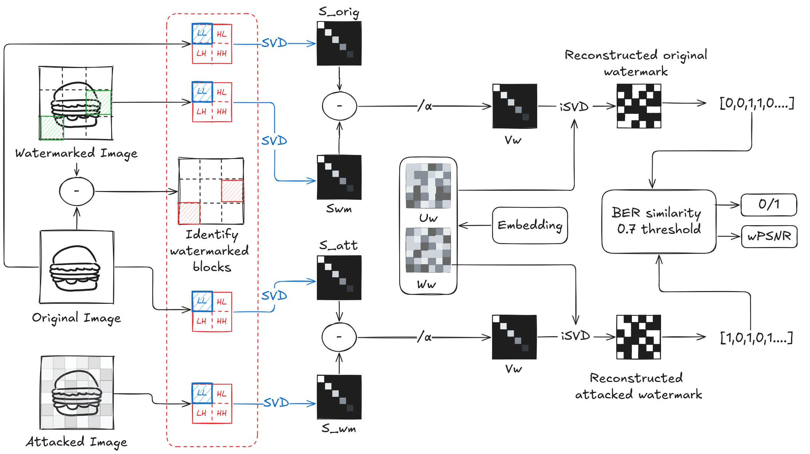
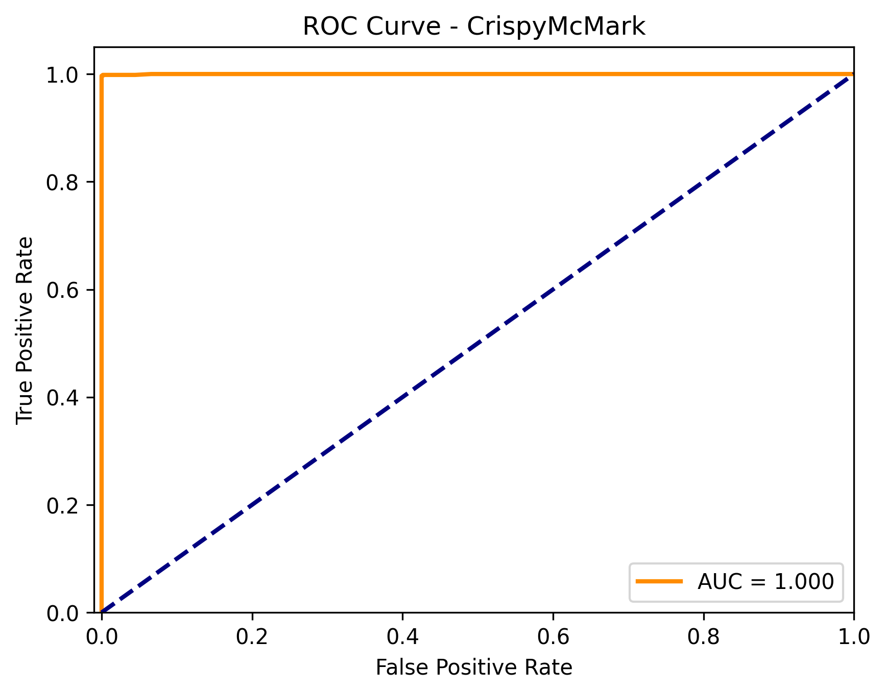
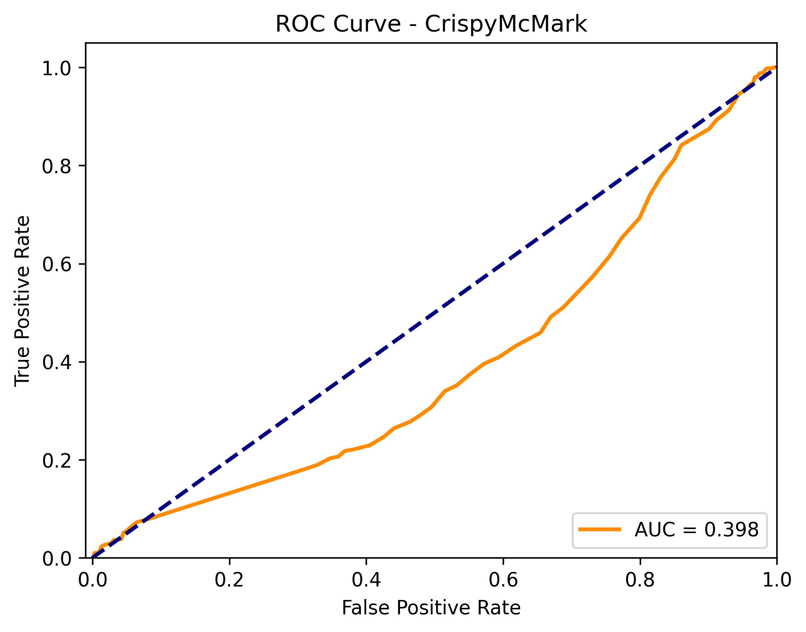
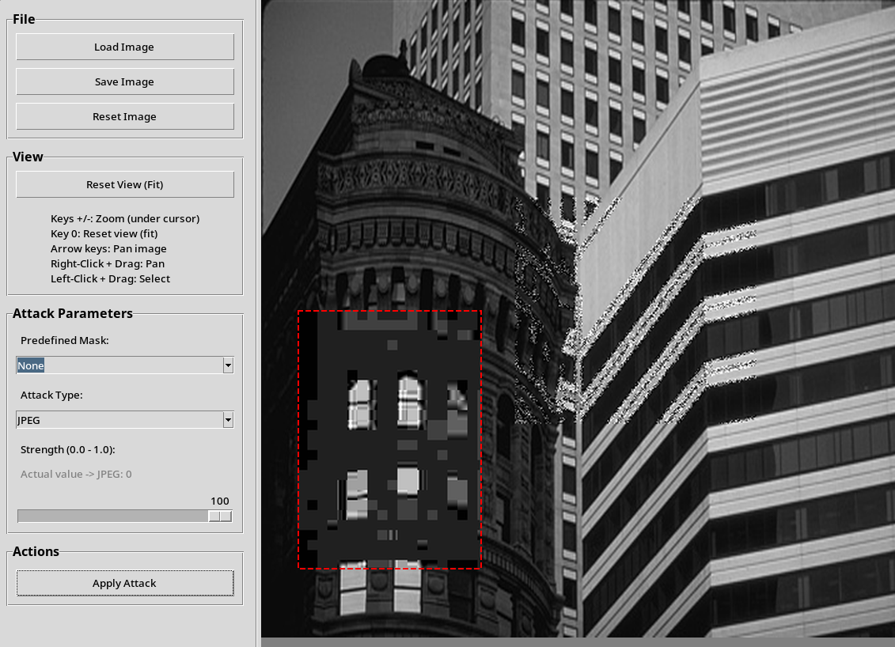
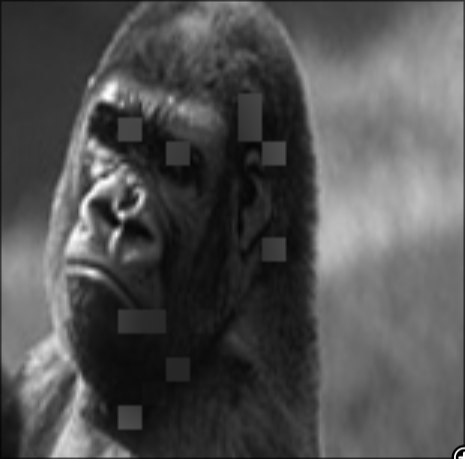

# CrispyMcMark
- Elia Gatti
- Pietro Ventrucci
- Filippo Marcon

---

# How we reached the final implementation
- found papers about DWT-SVD
- began with DWT-SVD on the whole image
- then transitioned to blocks, embedding two singular values for each block
- switched to embedding one singular value per block

---

<!-- paginate: true -->

# Embedding
- reshape watermark to 32x32 and take $U_w,V_w,W_w = SVD(watermark)$
- $U_w,W_w$ hardcoded in the detection, $V_w$ are the singular values
- choose $x$ square blocks
- forall $i<x$:
    - take $LL_b$ of the DWT of $blocks[i]$ 
    - compute the singular values $V_b$ of its $LL$
    - embed $V[i]$ into the first singular value($V_b[0]$) 
    - inverse the first two steps to reconstruct the block, and put it back into the image 

---

---

# Detection
- use watermarked - original image to find $x$ watermarked blocks
- attacked watermark = difference between singular values of attacked blocks and original blocks  
- original watermark = difference between singular values of watermarked blocks and original blocks  
- detection compares the two extracted watermarks using threshold

---

---

# Implementation challenges 
- Embedding quality performed better on images with high entropy zones
- On low entropy images embedding was more visible 
- Not enough time to refine the design and try different techniques
- Multiplicative embedding was harder to tweak
- Understanding how the algorithm performed/finding bugs based on the ROC function. 

---

# ROC1: Original 

 

---

<!-- nella presentazione spiegare che qui è uguale ma che quando stavamo facendo sviluppo veniva diverso/ci ha forzato a cambiare threshold -->
# ROC2

ROC1 + label 0 for original(attacked) images + label 0 for destroyed 

---

# Effects of hardcoding the watermark 
<!-- if we try to embed a different watermark than our group's the algorithm is shit -->

 

---

# Possible Improvements 
- Add redundancy based on singular value importance 
- Improve the invisibility of attack squares, either by block choice or embedding strength
- explore different embedding techniques on each block

--- 

# Attack Strategy
- binary search to find optimal attack strength
- attack functions tweaked to accept parameter $0\leq\beta\leq1$
- use of masks to attack different areas of the image
- parallelization to improve execution speed

---

# Attack Strategy - binary search

---

# Attack Strategy - masks

---

# Attack Strategy - GUI tool

---

# Questions?

